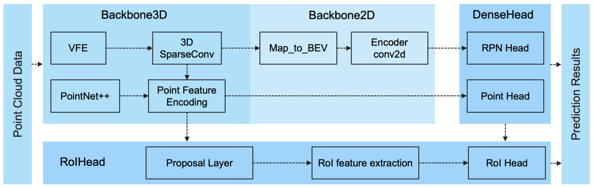
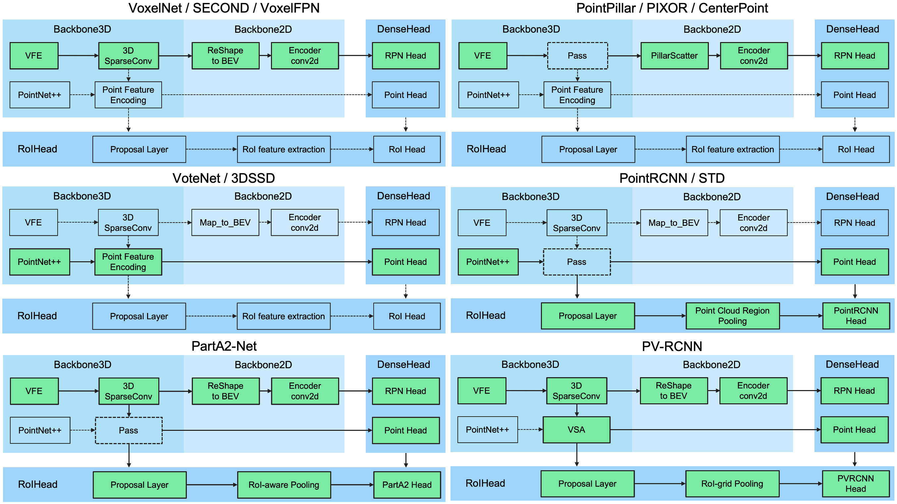

# OpenPCDet

`OpenPCDet` is a clear, simple, self-contained open source project for LiDAR-based 3D object detection. 

It is also the official code release of [`[PointRCNN]`](https://arxiv.org/abs/1812.04244), [`[Part-A2-Net]`](https://arxiv.org/abs/1907.03670), [`[PV-RCNN]`](https://arxiv.org/abs/1912.13192), [`[Voxel R-CNN]`](https://arxiv.org/abs/2012.15712), [`[PV-RCNN++]`](https://arxiv.org/abs/2102.00463) and [`[MPPNet]`](https://arxiv.org/abs/2205.05979). 

**Highlights**: 
* `OpenPCDet` has been updated to `v0.6.0` (Sep. 2022).
* The codes of PV-RCNN++ has been supported.
* The codes of MPPNet has been supported. 
* The multi-modal 3D detection approaches on Nuscenes have been supported. 

## Overview
- [Changelog](#changelog)
- [Design Pattern](#openpcdet-design-pattern)
- [Model Zoo](#model-zoo)
- [Installation](docs/INSTALL.md)
- [Quick Demo](docs/DEMO.md)
- [Getting Started](docs/GETTING_STARTED.md)
- [Citation](#citation)


## Changelog
[2023-06-30] **NEW:** Added support for [`DSVT`](https://arxiv.org/abs/2301.06051), which achieves state-of-the-art performance on large-scale Waymo Open Dataset with real-time inference speed (27HZ with TensorRT).

[2023-05-13] **NEW:** Added support for the multi-modal 3D object detection models on Nuscenes dataset.  
* Support multi-modal Nuscenes detection (See the [GETTING_STARTED.md](docs/GETTING_STARTED.md) to process data).
* Support [TransFusion-Lidar](https://arxiv.org/abs/2203.11496) head, which ahcieves 69.43% NDS on Nuscenes validation dataset.
* Support [`BEVFusion`](https://arxiv.org/abs/2205.13542), which fuses multi-modal information on BEV space and reaches 70.98% NDS on Nuscenes validation dataset. (see the [guideline](docs/guidelines_of_approaches/bevfusion.md) on how to train/test with BEVFusion).

[2023-04-02] Added support for [`VoxelNeXt`](https://arxiv.org/abs/2303.11301) on Nuscenes, Waymo, and Argoverse2 datasets. It is a fully sparse 3D object detection network, which is a clean sparse CNNs network and predicts 3D objects directly upon voxels.

[2022-09-02] **NEW:** Update `OpenPCDet` to v0.6.0:
* Official code release of [`MPPNet`](https://arxiv.org/abs/2205.05979) for temporal 3D object detection, which supports long-term multi-frame 3D object detection and ranks 1st place on [3D detection learderboard](https://waymo.com/open/challenges/2020/3d-detection) of Waymo Open Dataset on Sept. 2th, 2022. For validation dataset, MPPNet achieves 74.96%, 75.06% and 74.52% for vehicle, pedestrian and cyclist classes in terms of mAPH@Level_2. (see the [guideline](docs/guidelines_of_approaches/mppnet.md) on how to train/test with MPPNet).
* Support multi-frame training/testing on Waymo Open Dataset (see the [change log](docs/changelog.md) for more details on how to process data).
* Support to save changing training details (e.g., loss, iter, epoch) to file (previous tqdm progress bar is still supported by using `--use_tqdm_to_record`). Please use `pip install gpustat` if you also want to log the GPU related information.
* Support to save latest model every 5 mintues, so you can restore the model training from latest status instead of previous epoch.   

[2022-08-22] Added support for [custom dataset tutorial and template](docs/CUSTOM_DATASET_TUTORIAL.md) 

[2022-07-05] Added support for the 3D object detection backbone network [`Focals Conv`](https://openaccess.thecvf.com/content/CVPR2022/papers/Chen_Focal_Sparse_Convolutional_Networks_for_3D_Object_Detection_CVPR_2022_paper.pdf).

[2022-02-12] Added support for using docker. Please refer to the guidance in [./docker](./docker).

[2022-02-07] Added support for Centerpoint models on Nuscenes Dataset.

[2022-01-14] Added support for dynamic pillar voxelization, following the implementation proposed in [`H^23D R-CNN`](https://arxiv.org/abs/2107.14391) with unique operation and [`torch_scatter`](https://github.com/rusty1s/pytorch_scatter) package.

[2022-01-05] **NEW:** Update `OpenPCDet` to v0.5.2:
* The code of [`PV-RCNN++`](https://arxiv.org/abs/2102.00463) has been released to this repo, with higher performance, faster training/inference speed and less memory consumption than PV-RCNN.
* Add performance of several models trained with full training set of [Waymo Open Dataset](#waymo-open-dataset-baselines).
* Support Lyft dataset, see the pull request [here](https://github.com/open-mmlab/OpenPCDet/pull/720).


[2021-12-09] **NEW:**  Update `OpenPCDet` to v0.5.1:
* Add PointPillar related baseline configs/results on [Waymo Open Dataset](#waymo-open-dataset-baselines).
* Support Pandaset dataloader, see the pull request [here](https://github.com/open-mmlab/OpenPCDet/pull/396).
* Support a set of new augmentations, see the pull request [here](https://github.com/open-mmlab/OpenPCDet/pull/653).

[2021-12-01] **NEW:** `OpenPCDet` v0.5.0 is released with the following features:
* Improve the performance of all models on [Waymo Open Dataset](#waymo-open-dataset-baselines). Note that you need to re-prepare the training/validation data and ground-truth database of Waymo Open Dataset (see [GETTING_STARTED.md](docs/GETTING_STARTED.md)). 
* Support anchor-free [CenterHead](pcdet/models/dense_heads/center_head.py), add configs of `CenterPoint` and `PV-RCNN with CenterHead`.
* Support lastest **PyTorch 1.1~1.10** and **spconv 1.0~2.x**, where **spconv 2.x** should be easy to install with pip and faster than previous version (see the official update of spconv [here](https://github.com/traveller59/spconv)).  
* Support config [`USE_SHARED_MEMORY`](tools/cfgs/dataset_configs/waymo_dataset.yaml) to use shared memory to potentially speed up the training process in case you suffer from an IO problem.  
* Support better and faster [visualization script](tools/visual_utils/open3d_vis_utils.py), and you need to install [Open3D](https://github.com/isl-org/Open3D) firstly. 

[2021-06-08] Added support for the voxel-based 3D object detection model [`Voxel R-CNN`](#KITTI-3D-Object-Detection-Baselines).

[2021-05-14] Added support for the monocular 3D object detection model [`CaDDN`](#KITTI-3D-Object-Detection-Baselines).

[2020-11-27] Bugfixed: Please re-prepare the validation infos of Waymo dataset (version 1.2) if you would like to 
use our provided Waymo evaluation tool (see [PR](https://github.com/open-mmlab/OpenPCDet/pull/383)). 
Note that you do not need to re-prepare the training data and ground-truth database. 

[2020-11-10] The [Waymo Open Dataset](#waymo-open-dataset-baselines) has been supported with state-of-the-art results. Currently we provide the 
configs and results of `SECOND`, `PartA2` and `PV-RCNN` on the Waymo Open Dataset, and more models could be easily supported by modifying their dataset configs. 

[2020-08-10] Bugfixed: The provided NuScenes models have been updated to fix the loading bugs. Please redownload it if you need to use the pretrained NuScenes models.

[2020-07-30] `OpenPCDet` v0.3.0 is released with the following features:
   * The Point-based and Anchor-Free models ([`PointRCNN`](#KITTI-3D-Object-Detection-Baselines), [`PartA2-Free`](#KITTI-3D-Object-Detection-Baselines)) are supported now.
   * The NuScenes dataset is supported with strong baseline results ([`SECOND-MultiHead (CBGS)`](#NuScenes-3D-Object-Detection-Baselines) and [`PointPillar-MultiHead`](#NuScenes-3D-Object-Detection-Baselines)).
   * High efficiency than last version, support **PyTorch 1.1~1.7** and **spconv 1.0~1.2** simultaneously.
   
[2020-07-17]  Add simple visualization codes and a quick demo to test with custom data. 

[2020-06-24] `OpenPCDet` v0.2.0 is released with pretty new structures to support more models and datasets. 

[2020-03-16] `OpenPCDet` v0.1.0 is released. 


## Introduction


### What does `OpenPCDet` toolbox do?

Note that we have upgrated `PCDet` from `v0.1` to `v0.2` with pretty new structures to support various datasets and models.

`OpenPCDet` is a general PyTorch-based codebase for 3D object detection from point cloud. 
It currently supports multiple state-of-the-art 3D object detection methods with highly refactored codes for both one-stage and two-stage 3D detection frameworks.

Based on `OpenPCDet` toolbox, we win the Waymo Open Dataset challenge in [3D Detection](https://waymo.com/open/challenges/3d-detection/), 
[3D Tracking](https://waymo.com/open/challenges/3d-tracking/), [Domain Adaptation](https://waymo.com/open/challenges/domain-adaptation/) 
three tracks among all LiDAR-only methods, and the Waymo related models will be released to `OpenPCDet` soon.    

We are actively updating this repo currently, and more datasets and models will be supported soon. 
Contributions are also welcomed. 

### `OpenPCDet` design pattern

* Data-Model separation with unified point cloud coordinate for easily extending to custom datasets:
<p align="center">
  
</p>

* Unified 3D box definition: (x, y, z, dx, dy, dz, heading).

* Flexible and clear model structure to easily support various 3D detection models: 
<p align="center">
  
</p>

* Support various models within one framework as: 
<p align="center">
  
</p>


### Currently Supported Features

- [x] Support both one-stage and two-stage 3D object detection frameworks
- [x] Support distributed training & testing with multiple GPUs and multiple machines
- [x] Support multiple heads on different scales to detect different classes
- [x] Support stacked version set abstraction to encode various number of points in different scenes
- [x] Support Adaptive Training Sample Selection (ATSS) for target assignment
- [x] Support RoI-aware point cloud pooling & RoI-grid point cloud pooling
- [x] Support GPU version 3D IoU calculation and rotated NMS 


## Model Zoo

### KITTI 3D Object Detection Baselines
Selected supported methods are shown in the below table. The results are the 3D detection performance of moderate difficulty on the *val* set of KITTI dataset.
* All LiDAR-based models are trained with 8 GTX 1080Ti GPUs and are available for download. 
* The training time is measured with 8 TITAN XP GPUs and PyTorch 1.5.

|                                             | training time | Car@R11 | Pedestrian@R11 | Cyclist@R11  | download | 
|---------------------------------------------|----------:|:-------:|:-------:|:-------:|:---------:|
| [PointPillar](tools/cfgs/kitti_models/pointpillar.yaml) |~1.2 hours| 77.28 | 52.29 | 62.68 | [model-18M](https://drive.google.com/file/d/1wMxWTpU1qUoY3DsCH31WJmvJxcjFXKlm/view?usp=sharing) | 
| [SECOND](tools/cfgs/kitti_models/second.yaml)       |  ~1.7 hours  | 78.62 | 52.98 | 67.15 | [model-20M](https://drive.google.com/file/d/1-01zsPOsqanZQqIIyy7FpNXStL3y4jdR/view?usp=sharing) |
| [SECOND-IoU](tools/cfgs/kitti_models/second_iou.yaml)       | -  | 79.09 | 55.74 | 71.31 | [model-46M](https://drive.google.com/file/d/1AQkeNs4bxhvhDQ-5sEo_yvQUlfo73lsW/view?usp=sharing) |
| [PointRCNN](tools/cfgs/kitti_models/pointrcnn.yaml) | ~3 hours | 78.70 | 54.41 | 72.11 | [model-16M](https://drive.google.com/file/d/1BCX9wMn-GYAfSOPpyxf6Iv6fc0qKLSiU/view?usp=sharing)| 
| [PointRCNN-IoU](tools/cfgs/kitti_models/pointrcnn_iou.yaml) | ~3 hours | 78.75 | 58.32 | 71.34 | [model-16M](https://drive.google.com/file/d/1V0vNZ3lAHpEEt0MlT80eL2f41K2tHm_D/view?usp=sharing)|
| [Part-A2-Free](tools/cfgs/kitti_models/PartA2_free.yaml)   | ~3.8 hours| 78.72 | 65.99 | 74.29 | [model-226M](https://drive.google.com/file/d/1lcUUxF8mJgZ_e-tZhP1XNQtTBuC-R0zr/view?usp=sharing) |
| [Part-A2-Anchor](tools/cfgs/kitti_models/PartA2.yaml)    | ~4.3 hours| 79.40 | 60.05 | 69.90 | [model-244M](https://drive.google.com/file/d/10GK1aCkLqxGNeX3lVu8cLZyE0G8002hY/view?usp=sharing) |
| [PV-RCNN](tools/cfgs/kitti_models/pv_rcnn.yaml) | ~5 hours| 83.61 | 57.90 | 70.47 | [model-50M](https://drive.google.com/file/d/1lIOq4Hxr0W3qsX83ilQv0nk1Cls6KAr-/view?usp=sharing) |
| [Voxel R-CNN (Car)](tools/cfgs/kitti_models/voxel_rcnn_car.yaml) | ~2.2 hours| 84.54 | - | - | [model-28M](https://drive.google.com/file/d/19_jiAeGLz7V0wNjSJw4cKmMjdm5EW5By/view?usp=sharing) |
| [Focals Conv - F](tools/cfgs/kitti_models/voxel_rcnn_car_focal_multimodal.yaml) | ~4 hours| 85.66 | - | - | [model-30M](https://drive.google.com/file/d/1u2Vcg7gZPOI-EqrHy7_6fqaibvRt2IjQ/view?usp=sharing) |
||
| [CaDDN (Mono)](tools/cfgs/kitti_models/CaDDN.yaml) |~15 hours| 21.38 | 13.02 | 9.76 | [model-774M](https://drive.google.com/file/d/1OQTO2PtXT8GGr35W9m2GZGuqgb6fyU1V/view?usp=sharing) |

### Waymo Open Dataset Baselines
We provide the setting of [`DATA_CONFIG.SAMPLED_INTERVAL`](tools/cfgs/dataset_configs/waymo_dataset.yaml) on the Waymo Open Dataset (WOD) to subsample partial samples for training and evaluation, 
so you could also play with WOD by setting a smaller `DATA_CONFIG.SAMPLED_INTERVAL` even if you only have limited GPU resources. 

By default, all models are trained with **a single frame** of **20% data (~32k frames)** of all the training samples on 8 GTX 1080Ti GPUs, and the results of each cell here are mAP/mAPH calculated by the official Waymo evaluation metrics on the **whole** validation set (version 1.2).    

|    Performance@(train with 20\% Data)            | Vec_L1 | Vec_L2 | Ped_L1 | Ped_L2 | Cyc_L1 | Cyc_L2 |  
|---------------------------------------------|----------:|:-------:|:-------:|:-------:|:-------:|:-------:|
| [SECOND](tools/cfgs/waymo_models/second.yaml) | 70.96/70.34|62.58/62.02|65.23/54.24	|57.22/47.49|	57.13/55.62 |	54.97/53.53 | 
| [PointPillar](tools/cfgs/waymo_models/pointpillar_1x.yaml) | 70.43/69.83 |	62.18/61.64 | 66.21/46.32|58.18/40.64|55.26/51.75|53.18/49.80 |
[CenterPoint-Pillar](tools/cfgs/waymo_models/centerpoint_pillar_1x.yaml)| 70.50/69.96|62.18/61.69|73.11/61.97|65.06/55.00|65.44/63.85|62.98/61.46| 
[CenterPoint-Dynamic-Pillar](tools/cfgs/waymo_models/centerpoint_dyn_pillar_1x.yaml)| 70.46/69.93|62.06/61.58|73.92/63.35|65.91/56.33|66.24/64.69|63.73/62.24| 
[CenterPoint](tools/cfgs/waymo_models/centerpoint_without_resnet.yaml)| 71.33/70.76|63.16/62.65|	72.09/65.49	|64.27/58.23|	68.68/67.39	|66.11/64.87|
| [CenterPoint (ResNet)](tools/cfgs/waymo_models/centerpoint.yaml)|72.76/72.23|64.91/64.42	|74.19/67.96	|66.03/60.34|	71.04/69.79	|68.49/67.28 |
| [Part-A2-Anchor](tools/cfgs/waymo_models/PartA2.yaml) | 74.66/74.12	|65.82/65.32	|71.71/62.24	|62.46/54.06	|66.53/65.18	|64.05/62.75 |
| [PV-RCNN (AnchorHead)](tools/cfgs/waymo_models/pv_rcnn.yaml) | 75.41/74.74	|67.44/66.80	|71.98/61.24	|63.70/53.95	|65.88/64.25	|63.39/61.82 | 
| [PV-RCNN (CenterHead)](tools/cfgs/waymo_models/pv_rcnn_with_centerhead_rpn.yaml) | 75.95/75.43	|68.02/67.54	|75.94/69.40	|67.66/61.62	|70.18/68.98	|67.73/66.57|
| [Voxel R-CNN (CenterHead)-Dynamic-Voxel](tools/cfgs/waymo_models/voxel_rcnn_with_centerhead_dyn_voxel.yaml) | 76.13/75.66	|68.18/67.74	|78.20/71.98	|69.29/63.59	| 70.75/69.68	|68.25/67.21|
| [PV-RCNN++](tools/cfgs/waymo_models/pv_rcnn_plusplus.yaml) | 77.82/77.32|	69.07/68.62|	77.99/71.36|	69.92/63.74|	71.80/70.71|	69.31/68.26|
| [PV-RCNN++ (ResNet)](tools/cfgs/waymo_models/pv_rcnn_plusplus_resnet.yaml) |77.61/77.14|	69.18/68.75|	79.42/73.31|	70.88/65.21|	72.50/71.39|	69.84/68.77|

Here we also provide the performance of several models trained on the full training set (refer to the paper of [PV-RCNN++](https://arxiv.org/abs/2102.00463)):

| Performance@(train with 100\% Data)                                                       | Vec_L1 | Vec_L2 | Ped_L1 | Ped_L2 | Cyc_L1 | Cyc_L2 |  
|-------------------------------------------------------------------------------------------|----------:|:-------:|:-------:|:-------:|:-------:|:-------:|
| [SECOND](tools/cfgs/waymo_models/second.yaml)                                             | 72.27/71.69 | 63.85/63.33 | 68.70/58.18 | 60.72/51.31 | 60.62/59.28 | 58.34/57.05 | 
| [CenterPoint-Pillar](tools/cfgs/waymo_models/centerpoint_pillar_1x.yaml)                  | 73.37/72.86 | 65.09/64.62 | 75.35/65.11 | 67.61/58.25 | 67.76/66.22 | 65.25/63.77 | 
| [Part-A2-Anchor](tools/cfgs/waymo_models/PartA2.yaml)                                     | 77.05/76.51 | 68.47/67.97 | 75.24/66.87 | 66.18/58.62 | 68.60/67.36 | 66.13/64.93 |
| [VoxelNeXt-2D](tools/cfgs/waymo_models/voxelnext2d_ioubranch.yaml)                        | 77.94/77.47	|69.68/69.25	|80.24/73.47	|72.23/65.88	|73.33/72.20	|70.66/69.56 | 
| [VoxelNeXt](tools/cfgs/waymo_models/voxelnext_ioubranch_large.yaml)                       | 78.16/77.70	|69.86/69.42	|81.47/76.30	|73.48/68.63	|76.06/74.90	|73.29/72.18 |
| [PV-RCNN (CenterHead)](tools/cfgs/waymo_models/pv_rcnn_with_centerhead_rpn.yaml)          | 78.00/77.50 | 69.43/68.98 | 79.21/73.03 | 70.42/64.72 | 71.46/70.27 | 68.95/67.79 |
| [PV-RCNN++](tools/cfgs/waymo_models/pv_rcnn_plusplus.yaml)                                | 79.10/78.63 | 70.34/69.91 | 80.62/74.62 | 71.86/66.30 | 73.49/72.38 | 70.70/69.62 |
| [PV-RCNN++ (ResNet)](tools/cfgs/waymo_models/pv_rcnn_plusplus_resnet.yaml)                | 79.25/78.78 | 70.61/70.18 | 81.83/76.28 | 73.17/68.00 | 73.72/72.66 | 71.21/70.19 |
| [DSVT-Pillar](tools/cfgs/waymo_models/dsvt_pillar.yaml)                             | 79.44/78.97 | 71.24/70.81 | 83.00/77.22 | 75.45/69.95 | 76.70/75.70 | 73.83/72.86 |
| [DSVT-Voxel](tools/cfgs/waymo_models/dsvt_voxel.yaml)                             | 79.77/79.31 | 71.67/71.25 | 83.75/78.92 | 76.21/71.57 | 77.57/76.58 | 74.70/73.73 |
| [PV-RCNN++ (ResNet, 2 frames)](tools/cfgs/waymo_models/pv_rcnn_plusplus_resnet_2frames.yaml) | 80.17/79.70 | 72.14/71.70 | 83.48/80.42 | 75.54/72.61 | 74.63/73.75 | 72.35/71.50 |
| [MPPNet (4 frames)](docs/guidelines_of_approaches/mppnet.md)                              | 81.54/81.06 | 74.07/73.61 | 84.56/81.94 | 77.20/74.67 | 77.15/76.50 | 75.01/74.38 |
| [MPPNet (16 frames)](docs/guidelines_of_approaches/mppnet.md)                             | 82.74/82.28 | 75.41/74.96 | 84.69/82.25 | 77.43/75.06 | 77.28/76.66 | 75.13/74.52 |


We could not provide the above pretrained models due to [Waymo Dataset License Agreement](https://waymo.com/open/terms/), 
but you could easily achieve similar performance by training with the default configs.

### NuScenes 3D Object Detection Baselines
All models are trained with 8 GPUs and are available for download. For training BEVFusion, please refer to the [guideline](docs/guidelines_of_approaches/bevfusion.md).

|                                                                                                    |   mATE |  mASE  |  mAOE  | mAVE  | mAAE  |  mAP  |  NDS   |                                              download                                              | 
|----------------------------------------------------------------------------------------------------|-------:|:------:|:------:|:-----:|:-----:|:-----:|:------:|:--------------------------------------------------------------------------------------------------:|
| [PointPillar-MultiHead](tools/cfgs/nuscenes_models/cbgs_pp_multihead.yaml)                         | 33.87	 | 26.00  | 32.07	 | 28.74 | 20.15 | 44.63 | 58.23	 |  [model-23M](https://drive.google.com/file/d/1p-501mTWsq0G9RzroTWSXreIMyTUUpBM/view?usp=sharing)   | 
| [SECOND-MultiHead (CBGS)](tools/cfgs/nuscenes_models/cbgs_second_multihead.yaml)                   |  31.15 | 	25.51 | 	26.64 | 26.26 | 20.46 | 50.59 | 62.29  |  [model-35M](https://drive.google.com/file/d/1bNzcOnE3u9iooBFMk2xK7HqhdeQ_nwTq/view?usp=sharing)   |
| [CenterPoint-PointPillar](tools/cfgs/nuscenes_models/cbgs_dyn_pp_centerpoint.yaml)                 |  31.13 | 	26.04 | 	42.92 | 23.90 | 19.14 | 50.03 | 60.70  |  [model-23M](https://drive.google.com/file/d/1UvGm6mROMyJzeSRu7OD1leU_YWoAZG7v/view?usp=sharing)   |
| [CenterPoint (voxel_size=0.1)](tools/cfgs/nuscenes_models/cbgs_voxel01_res3d_centerpoint.yaml)     |  30.11 | 	25.55 | 	38.28 | 21.94 | 18.87 | 56.03 | 64.54  |  [model-34M](https://drive.google.com/file/d/1Cz-J1c3dw7JAWc25KRG1XQj8yCaOlexQ/view?usp=sharing)   |
| [CenterPoint (voxel_size=0.075)](tools/cfgs/nuscenes_models/cbgs_voxel0075_res3d_centerpoint.yaml) |  28.80 | 	25.43 | 	37.27 | 21.55 | 18.24 | 59.22 | 66.48  |  [model-34M](https://drive.google.com/file/d/1XOHAWm1MPkCKr1gqmc3TWi5AYZgPsgxU/view?usp=sharing)   |
| [VoxelNeXt (voxel_size=0.075)](tools/cfgs/nuscenes_models/cbgs_voxel0075_voxelnext.yaml)   |  30.11 | 	25.23 | 	40.57 | 21.69 | 18.56 | 60.53 | 66.65  | [model-31M](https://drive.google.com/file/d/1IV7e7G9X-61KXSjMGtQo579pzDNbhwvf/view?usp=share_link) |
| [TransFusion-L*](tools/cfgs/nuscenes_models/transfusion_lidar.yaml)   |  27.96 | 	25.37 | 	29.35 | 27.31 | 18.55 | 64.58 | 69.43  | [model-32M](https://drive.google.com/file/d/1cuZ2qdDnxSwTCsiXWwbqCGF-uoazTXbz/view?usp=share_link) |
| [BEVFusion](tools/cfgs/nuscenes_models/bevfusion.yaml)   |  28.03 | 	25.43 | 	30.19 | 26.76 | 18.48 | 67.75 | 70.98  | [model-157M](https://drive.google.com/file/d/1X50b-8immqlqD8VPAUkSKI0Ls-4k37g9/view?usp=share_link) |

*: Use the fade strategy, which disables data augmentations in the last several epochs during training.

### ONCE 3D Object Detection Baselines
All models are trained with 8 GPUs.

|                                                        | Vehicle | Pedestrian | Cyclist | mAP    |
| ------------------------------------------------------ | :-----: | :--------: | :-----: | :----: |
| [PointRCNN](tools/cfgs/once_models/pointrcnn.yaml)     | 52.09   | 4.28       | 29.84   | 28.74  |
| [PointPillar](tools/cfgs/once_models/pointpillar.yaml) | 68.57   | 17.63      | 46.81   | 44.34  |
| [SECOND](tools/cfgs/once_models/second.yaml)           | 71.19   | 26.44      | 58.04   | 51.89  |
| [PV-RCNN](tools/cfgs/once_models/pv_rcnn.yaml)         | 77.77   | 23.50      | 59.37   | 53.55  |
| [CenterPoint](tools/cfgs/once_models/centerpoint.yaml) | 78.02   | 49.74      | 67.22   | 64.99  |

### Argoverse2 3D Object Detection Baselines
All models are trained with 4 GPUs.

|                                                         | mAP  |                                              download                                              | 
|---------------------------------------------------------|:----:|:--------------------------------------------------------------------------------------------------:|
| [VoxelNeXt](tools/cfgs/argo2_models/cbgs_voxel01_voxelnext.yaml)        | 30.5 | [model-32M](https://drive.google.com/file/d/1YP2UOz-yO-cWfYQkIqILEu6bodvCBVrR/view?usp=share_link) |

### Other datasets
Welcome to support other datasets by submitting pull request. 

## Installation

Please refer to [INSTALL.md](docs/INSTALL.md) for the installation of `OpenPCDet`.


## Quick Demo
Please refer to [DEMO.md](docs/DEMO.md) for a quick demo to test with a pretrained model and 
visualize the predicted results on your custom data or the original KITTI data.

## Getting Started

Please refer to [GETTING_STARTED.md](docs/GETTING_STARTED.md) to learn more usage about this project.


## License

`OpenPCDet` is released under the [Apache 2.0 license](LICENSE).

## Acknowledgement
`OpenPCDet` is an open source project for LiDAR-based 3D scene perception that supports multiple
LiDAR-based perception models as shown above. Some parts of `PCDet` are learned from the official released codes of the above supported methods. 
We would like to thank for their proposed methods and the official implementation.   

We hope that this repo could serve as a strong and flexible codebase to benefit the research community by speeding up the process of reimplementing previous works and/or developing new methods.


## Citation 
If you find this project useful in your research, please consider cite:


```
@misc{openpcdet2020,
    title={OpenPCDet: An Open-source Toolbox for 3D Object Detection from Point Clouds},
    author={OpenPCDet Development Team},
    howpublished = {\url{https://github.com/open-mmlab/OpenPCDet}},
    year={2020}
}
```

## Contribution
Welcome to be a member of the OpenPCDet development team by contributing to this repo, and feel free to contact us for any potential contributions. 


