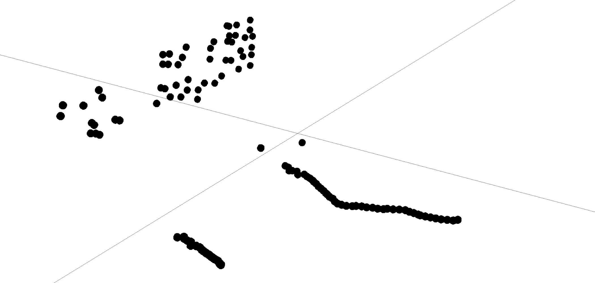
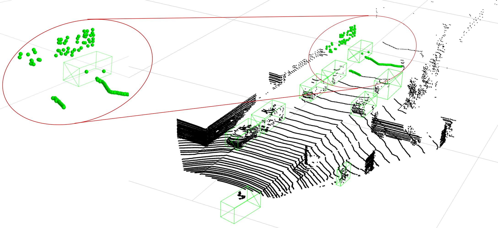
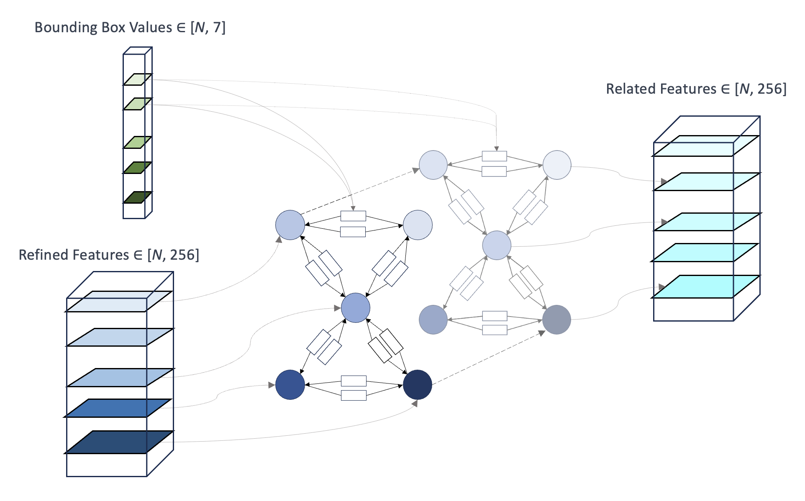

# Object Relation for 3D Object Detection

**Can you spot the vehicle in this point-cloud and can you precisely draw a bounding box around it?**

  

In this example it seems difficult to detect the object. However, that's exactly what we expecet of current SoTA object detectors, given their limited receptive field. This project hypothesises that the receptive field of different architectures does not capture enough context to deal with occlusions and sparsity of 3D data.

<figure>
  
</figure>

If we look at the full scene, it becomes clear that context can help us detect the vehicle correctly. However, simply increasing the receptive field would not give enough context while still being computationally feasible. Therefore, this project, comparable to previous work, proposes to model context efficiently with object relation.

<figure>
  
  <figcaption>Object Relation as an efficient Way to model Context</figcaption>
</figure>

## Architecture

To model object relation, this project introduces a GNN. The nodes in the graph are the detected objects; their features are obtained by the second stage of the model (refined features). The edges of the graph are obtained via a radius graph or knn (distance can be measured in R3 or in feature space). Global information, how the objects relate to each other, are infused into the edges. After the GNN is applied the model obtains a feature vector for each object that contains information about all the other objects. 

## Results

