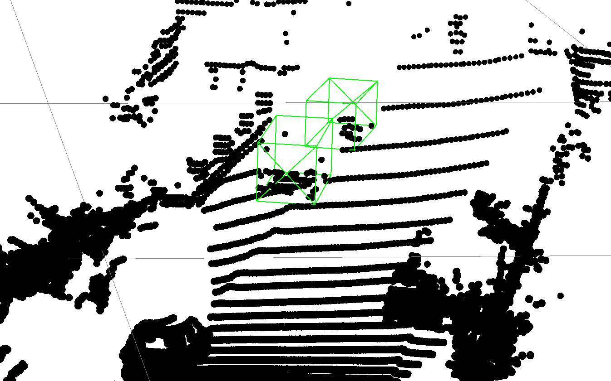
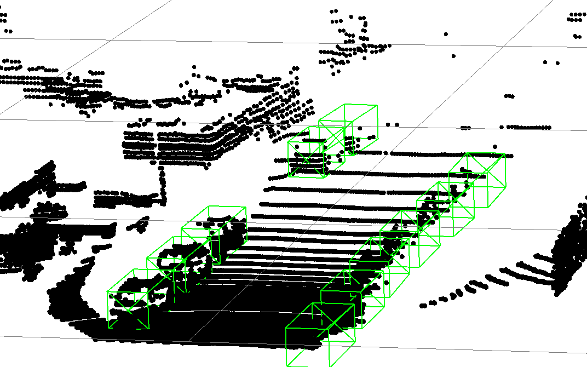
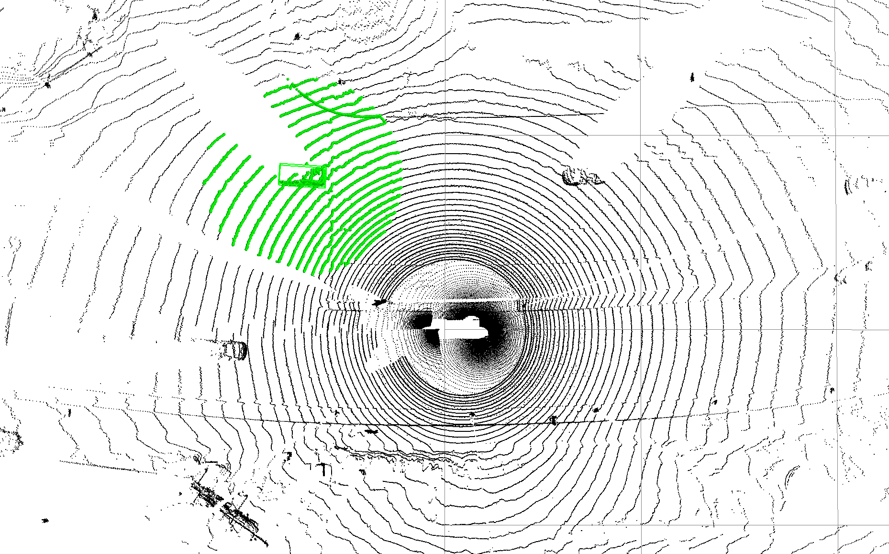
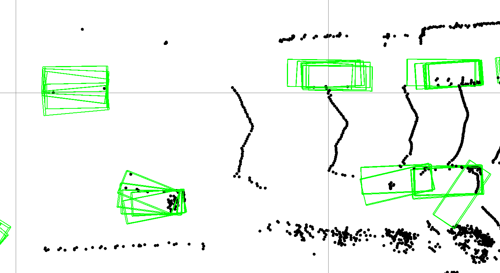
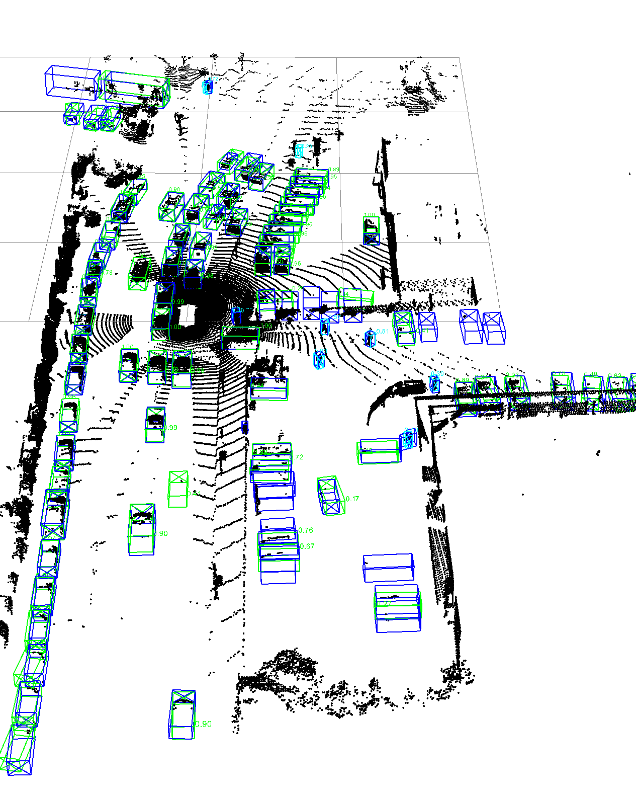
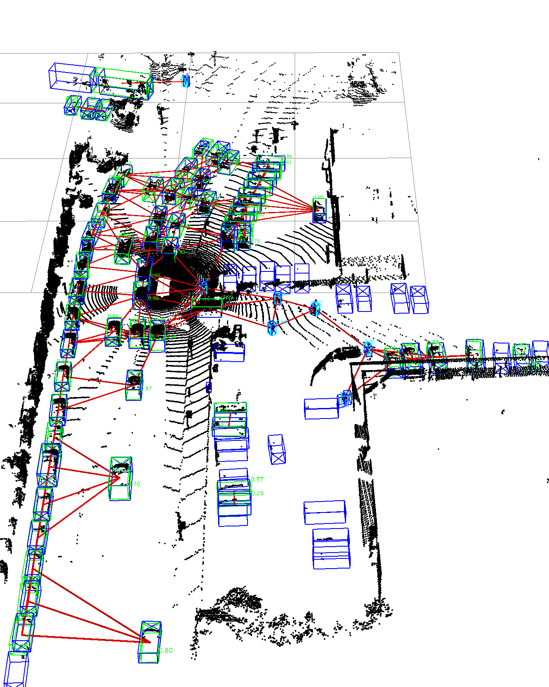

# Object Relations for 3D Object Detection

This work focuses on exploring the impact of modeling object relation in two-stage object detection pipelines, aiming to enhance their detection performance. It extends OpenPCDet with a module that models object relations which can be integrated into existing object detectors. To get this project running please check [OpenPCDet](https://github.com/open-mmlab/OpenPCDet).
 

## Project Structure

This project extends [OpenPCDet](https://github.com/open-mmlab/OpenPCDet) with a module that relates object proposals with each other. Different implementation of this model can be found in **pcdet/models/object_relation**.

## Motivation

There are four motivations for modeling object relations in the refinement stage of two-stage object detection pipelines.

- **Detecting Occlusions:** If information between an occluded and an occluder object is shared, the occluded object can be informed about its occlusion status. This can help the model learn the difference between sparse proposals that are heavily occluded and noise in the data.

- **Exploiting Patterns:** Traffic scenes often follow specific patterns that can be exploited by the object detector.

- **Increase of Receptive Fields:** Current object detectors fail to incorporate enough context in the refinement stage because their receptive fields are too small. Object relations can be seen as an efficient mechanism to increase the receptive field.

- **Proposal Consensus:** Proposals often form clusters around potential objects. Each proposal might have a different view of the object. Sharing information between these proposals leads to a consensus prediction.

|  |  |
|:--------------------------:|:--------------------------:|
| *Detecting Occlusions*      | *Exploiting Patterns*      |
|  |  |
|:--------------------------:|:--------------------------:|
| *Increase of Receptive Fields*      | *Proposals Consensus*      |

# PV-RCNN-Relation

PV-RCNN-Relation is a implementation of a object relations module applied to the PVRCNN baseline. It beats its baseline on all difficulties for the vehicle class.

## Results

| Model             | Easy R11 / R40 | Moderate R11 / R40 | Hard R11 / R40 | All R11 / R40 |
|-------------------|----------------|--------------------|----------------|---------------|
| PVRCNN            | 89.39 / 92.02  | 83.63 / 84.80      | 78.86 / 82.58  | 83.91 / 86.45 |
| PVRCNN-Relation   | 89.59 / 92.53  | 84.56 / 85.22      | 79.04 / 82.99  | 84.35 / 86.90 |
| *Improvement*     | **+0.20 / +0.51** | **+0.93 / +0.42** | **+0.18 / +0.41** | **+0.44 / +0.45** |

*Comparison of PVRCNN and PVRCNN-Relation on KITTI validation set. Trained and evaluated only on the car class. All models were trained for 80 epochs and the best-performing epoch per model and metric was chosen. **Both models were trained three times** and the average is reported. The* Improvement *row represents the difference in mAP between the two models. See table for full results.*

| | |
|:-------------------------:|:-------------------------:|
|  |  |
|  |  |

Qualitative results for PV-RCNN baseline and PV-RCNN-Relation on Waymo data. Predictions are shown in green, labels in blue and edges that connect proposals to share information in red. 

