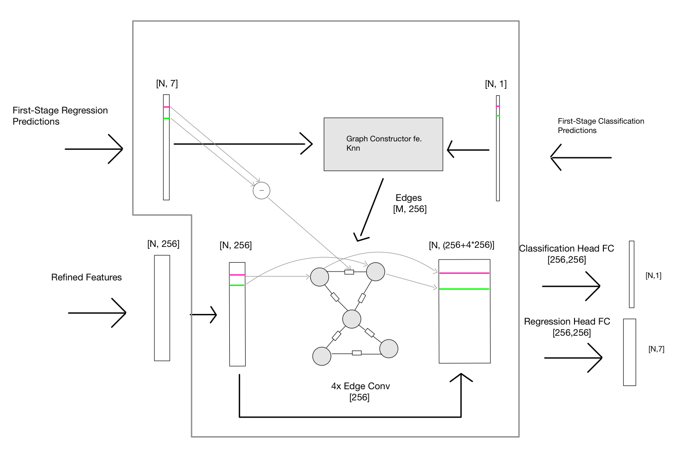

# Object Relation for 3D Object Detection

3D object detectors usually predict objects independently from each other. Given the limited receptive field for each object, they are missing the required context. Especially when it comes to heavily occluded or sparse objects, context is necessary to correctly predict 3D bounding boxes. Simply increasing the receptive field would not give enough context while still being computationally feasible. Therefore, this project, comparable to previous work, proposes to model context efficiently with object relation.

<figure>
  
  <figcaption>Object Relation as an efficient Way to model Context</figcaption>
</figure>

## Architecture

To model object relation, this project introduces a GNN. The nodes in the graph are the detected objects; their features are obtained by the second stage of the model (refined features). The edges of the graph are obtained via a radius graph or knn (distance can be measured in R3 or in feature space). Global information, how the objects relate to each other, are infused into the edges. After the GNN is applied the model obtains a feature vector for each object that contains information about all the other objects. 

## Results

