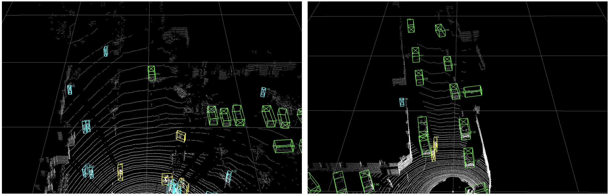

# Quick Demo

Here we provide a quick demo to test a pretrained model on the custom point cloud data and visualize the predicted results. 

We suppose you already followed the [INSTALL.md](INSTALL.md) to install the `OpenPCDet` repo successfully. 

1. Download the provided pretrained models as shown in the [README.md](../README.md). 

2. Make sure you have already installed the `mayavi` visualization tools. If not, you could install it as follows:
   ```
   pip install mayavi
   ```

3. Prepare you custom point cloud data (skip this step if you use the original KITTI data). 
   * You need to transform the coordinate of your custom point cloud to 
the unified normative coordinate of `OpenPCDet`, that is, x-axis points towards to front direction, 
y-axis points towards to the left direction, and z-axis points towards to the top direction.
   * (Optional) the z-axis origin of your point cloud coordinate should be about 1.6m above the ground surface, 
   since currently the provided models are trained on the KITTI dataset. 
   * Set the intensity information, and save your transformed custom data to `numpy file`: 
   ```python
   # Transform your point cloud data
   ...
   
   # Save it to the file. 
   # The shape of points should be (num_points, 4), that is [x, y, z, intensity],  
   # If you doesn't have the intensity information, just set them to zeros. 
   # If you have the intensity information, you should normalize them to [0, 1].
   points[:, 3] = 0 
   np.save(`my_data.npy`, points) 
   ```      
  
4. Run the demo with a pretrained model (e.g. PV-RCNN) and your custom point cloud data as follows:
```shell
python demo.py --cfg_file cfgs/kitti_models/pv_rcnn.yaml \
    --ckpt pv_rcnn_8369.pth \
    --data_path ${POINT_CLOUD_DATA}
```
Here `${POINT_CLOUD_DATA}` could be the following format: 
* Your transformed custom data with a single numpy file like `my_data.npy`.  
* Your transformed custom data with a directory to test with multiple point cloud data.
* The original KITTI `.bin` data within `data/kitti`, like `data/kitti/training/velodyne/000008.bin`.   

Then you could see the predicted results with visualized point cloud as follows:

<p align="center">
  
</p>
