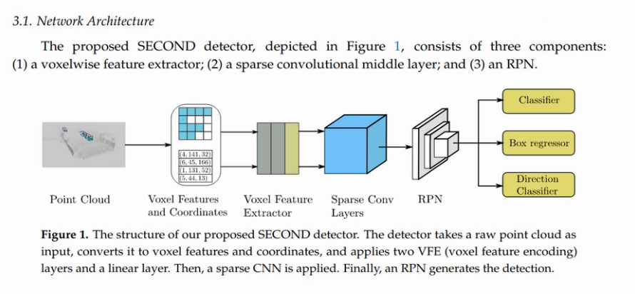
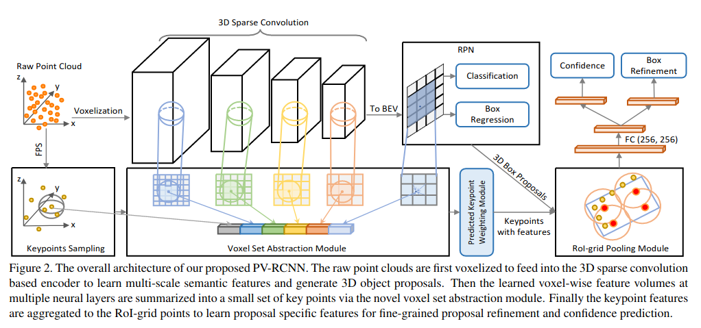

# OpenPCDet

`OpenPCDet` is a clear, simple, self-contained open source project for LiDAR-based 3D object detection. 

This tutorial is about 3D Multi Object Detection using Lidar and includes detailed information for related papers, model architectures, dataset types and the usage of OpenPCDET for this goal. To have other informations about OpenPCDET or related issues please refer to the official repo which I forked from.

# Includings

## Dataset Types

* Kitti 
* Nuscene
* Pandaset

## Paper Reviews

* Pointnet
* Voxelnet
* Second
* Pointpillar
* PV-RCNN
* PV-RCNN++


## OpenPCDET Usage and Experiments

* Build the Environment
* Train Evaluate and Inference with Kitti
* Common Errors and the Ways to Fix
* Flow Charts of The Code

## Fine Tuning with Kitti 

# Dataset Types

There are different datasets open for Autonomus Driving researchs. 3 of them is examined in this report.

## Kitti

The first and naturally oldest dataset. 

<b> The setup contains: </b>

- 2 RGB camera facing forward (10 Hz)
- 2 Grayscale camera facing forward (10 Hz)
- 1 Velodyne Lidar Sensor (10 Hz, 64 laser beams, 100 m range)


<b> The Lidar Coordinate System and the Ranges </b>

- x-axes : front, y-axes : left, z axes : up

- The point cloud range used for model training [0, -40, -3, 70.4, 40, 1] (xmin ymin zmin xmax ymax zmax) which gives 70.4 meters for front view, 80 meters for side view being left and right and 4 meters for the height range

- The intensity range [0,1]

- Lidar located at 1.73 m 


<b>  Format </b>

- Lidar data contains x, y, z, intensity informations and its in .bin format

  

- Object Detection annotation files contains the following information and its in .txt format 
          

   
   

* The dataset contains 8 classes for object detection: Car, Van, Truck, Pedestrian, Person(sitting), Cyclist, Tram, Misc 

- In addition to the Object Detection dataset and annotations, there is another dataset for Object Tracking having the data arranged in sequences rather than different scenes from different moments like in Object Detection dataset. For this dataset the annotation format has 2 additional info 

   
   


* As seen in annotation format too, <b> the ground truth annotations of the KITTI dataset has been provided in the 2D image space (in left grayscale camera frame called reference camera frame) not in 3D lidar space. </b> Therefore, to work with Lidar data, these 2D annotations should be converted to the 3D space using calibration files which gives the rotation and translation matrices between the lidar and camera sensors for each spesific frame.  <b>  Having annotations in image space is the base reason to cut the poing cloud x axis range to [0,70]. So we use only the front view but not the back view since the cameras only setup face forward (since the annotations located only in front side) . </b> 

   

   <b> P2 </b> : the left RGB camera's projection matrix from the reference camera frame

   <b> R0_rect </b>: Rectification matrix (correct the planar alignment between camera and reference camera frame) 

   <b>  Tr_velo_to_cam </b>: Point clouds frame to reference camera frame rigid body transformation (translation + rotation) matrix

   To understand better the usage of these calibration information, the data transformation between annotation boxes to lidar data is explained below.

<b> Data Transformation in Kitti </b>

* There are 3 steps between lidar and image plane:

   

   In general, to project bounding boxes in lidar space, we first go from lidar to image plane to eliminate the point clouds staying outside of the image borders. Then project the bounding boxes on this newly created lidar space.

   From Lidar to Image Plane
   ```

   proj_mat = P2 @ R0_rect @ Tr_velo_to_cam

   ```

   Boxes in lidar plane 

   ```

   R_inv = np.linalg.inv(R0_rect)
   Tr_inv = np.linalg.inv(Tr_velo_to_cam)

   proj_mat = R_inv @ Tr_inv 

   ```

   Bounding boxes in cropped lidar space:

   

   Bounding boxes in not cropped lidar space:

    
   


   To visualize bounding boxes in images, a simple projection should be applied too since the bounding boxes are in reference camera frame and the RGB images are provided in the dataset. (which is better than grayscale reference camera to visualize...) 

   3D Bounding Boxes In Cam2 Image Plane

   ```
   proj_mat = P2

   ```

   

   Most of the frameworks to train a model with kitti already applies these transformations as preprocess, but to visualize or process the data manually this [repo](https://github.com/darylclimb/cvml_project/tree/cb06850b9477550b9c9e3c5651d013b347cc9b1b/projections/lidar_camera_projection)  can be used. 

<b> Visualization </b>

Another nice [repo](https://github.com/kuixu/kitti_object_vis) to visualize kitti with ground truth boxes and labels in 3D lidar space. I use this one to visualize ground truths at the same time with the model output to compare.
Using  repo, the kitti point cloud data with ground truth boxes can be visualized in 3D space.

1. conda create -n kitti_vis python=3.7
2. conda activate kitti_vis
3. pip install opencv-python pillow scipy matplotlib
4. conda install mayavi -c conda-forge
5. pip install poetry
6. pip install importlib-resources
7. put your data in data/object/ folder as explained in readme <br>
   
8. python kitti_object.py --show_lidar_with_depth --img_fov --const_box --vis

   


<b> Links </b>

* Object Detection Dataset: http://www.cvlibs.net/datasets/kitti/eval_object.php?obj_benchmark=3d 

* Object Tracking Dataset : http://www.cvlibs.net/datasets/kitti/eval_tracking.php 

* Kitti Dataset Paper : http://www.cvlibs.net/publications/Geiger2012CVPR.pdf 

* Data Transform : https://github.com/darylclimb/cvml_project/tree/cb06850b9477550b9c9e3c5651d013b347cc9b1b/projections/lidar_camera_projection 

* Visualization : https://github.com/kuixu/kitti_object_vis 

## Pandaset

<b> The setup contains: </b>

* 6 RGB camera located to have 360 degree view from front to back (10 Hz)
* 2 Lidar : Pandar64 -mechanical 360° (10 Hz, 64 channel beams, 200 m rang)) and PandarGT -forward facing (10 Hz, 150 channel beams, 300 m range)

   


<b> The Lidar Coordinate System and the Ranges </b>

- x-axes : left, y-axes : back, z axes : up

- The point cloud range used for model training:


   for Pandar64 [-70, -40, -3, 70, 40, 1] (xmin ymin zmin xmax ymax zmax) <br>
   for PandarGT [0, -40, -3, 211, 40, 1] (xmin ymin zmin xmax ymax zmax) 

- The intensity range [0,255]

- Lidar located at ?? (missing info)


<b>  Format </b>

- Lidar data contains x, y, z, intensity, timestamp and lidar id information in .pkl format

   if d = 0 : Pandar64 <br>
   if d = 1 : PandarGT

   

- Annotation files in .pkl format

   

   ```
   Index(['uuid', 'label', 'yaw', 'stationary', 'camera_used', 'position.x',
       'position.y', 'position.z', 'dimensions.x', 'dimensions.y',
       'dimensions.z', 'attributes.object_motion', 'cuboids.sibling_id',
       'cuboids.sensor_id', 'attributes.rider_status',
       'attributes.pedestrian_behavior', 'attributes.pedestrian_age'],
      dtype='object')
   ```

<b> Visualization </b>

Didnt try

<b> Links </b>

* Dataset: https://scale.com/open-datasets/pandaset 

* Panda Dataset Paper : https://arxiv.org/pdf/2112.12610.pdf 

* Devkit : https://github.com/scaleapi/pandaset-devkit 

## Nuscene


<b> The setup contains: </b>

* 6 RGB camera located to have 360 degree view from front to back (12 Hz)
* 1 Lidar : 32 beams, 20Hz 

   


<b> The Lidar Coordinate System and the Ranges </b>

- x-axes : right, y-axes : front, z axes : up

- The point cloud range used for model training [-51.2, -51.2, -5.0, 51.2, 51.2, 3.0]  (xmin ymin zmin xmax ymax zmax) 
- The intensity range [0,255]

- Lidar located at 1.84 m


<b>  Format </b>

- Lidar data contains x, y, z, intensity, and timestamp information in .bin format

   

- Annotation files in .json format

   Instead of having an individual annotation file for each lidar - image pair, it is stored in one sample_annotation.json file with scene - frame information

   


<b> Visualization </b>

Using this [repo](https://github.com/pyaf/nuscenes_viz) its pretty easy to visualize nuscene data with ground truths in 3D lidar space. 

1. Clone the repo
2. conda create -n nuscene-vis python=3.7
3. pip install -U lyft_dataset_sdk
4. pip install mayavi
5. pip install psutil
5. pip install pyqt5
6. python lyft_viz.py -d /home/yagmur/Desktop/OpenPCDet/data/nuscenes/v1.0-mini/visualize/ --scene fcbccedd61424f1b85dcbf8f897f9754

   

!! If you have an error saying  Could not load the Qt platform plugin "xcb", just go to anacondaenv->lib/python3.7/site-packages/cv2/qt/plugins and delete this plugins folder

Everytime pressing enter, it is passed to the next "sample" in the "selected scene"


<b> Links </b>

* Dataset:  https://www.nuscenes.org/nuscenes 

* Nuscene Dataset Paper :  https://arxiv.org/pdf/1903.11027.pdf 

* Devkit : https://github.com/nutonomy/nuscenes-devkit

* Visualization : https://github.com/pyaf/nuscenes_viz 

## Comparison Table


# Paper Reviews

## Pointnet

paper : https://arxiv.org/pdf/1612.00593.pdf  

a good video explains the paper : https://www.youtube.com/watch?v=_py5pcMfHoc

official code : https://github.com/charlesq34/pointnet

* First paper proposes to process 3D points directly, without projecting to 2D images etc
* Challenges for processing point clouds <br>
   1. The lidar data is unstructured so the model should be permutation invariant (if you have n points you have n! permutations of ordering and processing this data)

       

   2. Interaction of points (the relation between neighbor points (local features) and general relation (global features) should be extracted. For classification, the global features are important since the task is to decide for a global class for the whole point cloud. For segmentation,  a combination of local and global knowledge is required

   3. The model should be transform(translation - rotation) invariant  (A chair is still a chair when its rotated 90 degree etc°

   ### Model Architecture


    

   * <b> Input and Feature Transform </b>

      Both using T-Net (which is an independent neural network consists of 3 convolutional, 1 max pooling and 2 fully connected layers inorde) trained to estimate different transform matrices to be applied by matrix multiplication. Input transform is applied to the first input and the feature transform to the first feature map comes after input layer.

      This is the <b> solution for transform invariant </b> challenge that this paper proposes!

   * <b> MLP (Multi layer perception) </b>

      Nothing more than a fully connected layer. The trick here is to use this fully connected layer 1 by 1 to the points come from transform layer then to concatanate.

   * <b> Max Pooling </b>

      The second MLP layer gives nx1024 output and a maximul pooling layer is applied on it. In this way, the global features are obtained without depending on the points order. <b> This is the solution for unstructured data challenge </b> that the paper proposes! 

   * These global features directly goes to classify the point cloud

   * Local and global features are concatenated for segmentation part as an extention of the    architecture.

      

   
   PointNet architecture doesnt allow to do Object Detection alone but after this paper, various methods to realize object detection on point cloud data is started to come up.

## Voxelnet

paper : https://arxiv.org/pdf/1711.06396.pdf 

a good video explains the paper : https://www.youtube.com/watch?v=Ox1qNGgEqPU&t=169s 

Nice implementation : https://github.com/gkadusumilli/Voxelnet 

* First paper realize end to end 3d object detection processing Point Cloud Data.
* First paper uses Pointnet logic inside.
* Pointnet is for processing pretty small point cloud data having about <b> 1000 points </b> referring to a simple object like chair table etc. If the subject is Autonomus Driving, around <b> 100k points </b> are found in an environment with different objects to detect like Cars, Pedestrians, Cyclists, Van, Truck, Trees, Buildings etc. This fact make Pointnet method requires too much computational cost and slow speed. In this sense, <b> Voxelnet comes with the idea of dividing the whole Point Cloud in voxels and process them one by one </b>.

<b> Model Architecture </b>


It contains 3 main steps:

1. 3D data to Voxel partition -> Feature learning network (Process these points in voxels similarly to how Pointnet does)
2. Convolutional middle layers (3D CNN to extract the features)
3. Region proposal network (last layer to obtain detection results)


* <b> Voxel Partition </b>

1. Voxel depth, height, width referring to the z y x axes are determined. 
A grid size having D = point cloud z range / voxel depth, H = point cloud y range / voxel height,  W = point cloud w range / voxel width is calculated. Being T is the maximum number of points in a voxel, all the points are selected randomly one by one and placed in the most near voxel. If a voxel is already full, the selected point is ignored. ( <b> Random Sampling </b>)

* <b> Feature Learning Network </b>

The Feature Learning consists of 2 VFE (Voxelnet Feature Encoding) layers which are identical structures (except of their size being <b> VFE-1(7, 32) and VFE-2(32, 128) </b> ) applied in a row. 

In this sense:

2. One point in a voxel has the following structure : <br>
Vin = {ˆpi =[xi, yi, zi, ri, xi − vx, yi − vy , zi − vz ]T ∈ R7}i=1...t. 
Which explains that every input point in a voxel has <b> 7 features being x,y,z coordinates, reflectance (or intensity), the mean of the x coordinates in a voxel - x, the mean of the y coordinates in a voxel - y, the mean of the z coordinates in a voxel - z </b>

3. Instead of having n x 3 points like in PointNet, 7 x n points are given as input to the shared Fully Connected Layer and 16 x n matrix is obtained as output. 

4. Keeping a copy of this output aside as local features, max pooling is applied to obtain global features in 32 x 1 size. These global features are concatenated with local features and the 32 x n output feature map is passed to the next VFE layer.

   

5. The same logic is applied this time for a shared Fully Connected Layer and obtained 64 x n matrix is obtained as output. Keeping a copy of this output aside as local features, max pooling is applied to obtain global features in 64 x 1 size. These global features are concatenated with local features and a last maximum pooling is applied to the 64 x n output feature map to obtain the final output of the Feature Learning Network for one Voxel

6. This output is 128x1 vector and all the outputs come from voxels are concatenated through the same locations they come from. Which gives us 128xDxWxH size 4D tensor. (128 x Grid Size output tensor)

    

In the paper, following sizes are used for Kitti Dataset:

Point Cloud Range -> z: [−3, 1] y: [−40, 40] x: [0, 70.4] 
Voxel Size -> vD = 0.4, vH = 0.2, vW = 0.2 meters. 
Grid Size -> D = 4 / 0.4 = 10 , W = 80 / 0.2 = 400 , H = 70.4 / 0.2 = 352 

Which gives  10x400x352 = 1408000 voxels to send the Feature Learning Layer 1 by 1 and a 128 × 10 × 400 × 352 4D tensor is obtained.


This 4D tensor is then passed to the 3D CNN.


* <b> Convolutional Middle Layers </b>

   This step consists of 3 convolutional layers to extract features in 3D. 

   Conv3D(128, 64, 3,(2,1,1), (1,1,1)) <br>
   Conv3D(64, 64, 3, (1,1,1), (0,1,1)) <br>
   and Conv3D(64, 64, 3, (2,1,1), (1,1,1)) in order.
   
   with respect to the following syntax 
   Conv3D(cin, cout, k, s, p) 

   cin : input channel size <br>
   cout : output channel size <br>
   k : kernel size <br>
   s : stride <br>
   p : padding  <br>

   ! k, s, p can be either an integer or tuple. If integer, that means all 3 dimensions is in equal size. For example in Voxelnet architecture the kernel size is 3 for both depth, width and height.

   The output of a 3D convolutional layer is calculated according to the following equation :

   

   Accordingly, we can visualize Voxelnet 3D Feature Extraction process as follows:

   

   This (64 × 2 × 400 × 352) output 4D tensor then reshaped to (128 x 400 x 352) to be able to apply 2D convolutions and obtain detection results.

   RESIM : buraya 3D feature mapler gelmeli. Bir train basinda bir de train sonunda 3D feature mapslerimiz neye benziyor.


* <b> Region proposal network </b>

   An RPN in general refers to a neural network used to predict different ROI locations with objectness score without classifying. It is performed via a sliding window to travel the feature map and being every center point of the sliding window an anchor point, and creating k different fixed size anchor boxes. After obtaining anchor boxes, through 2 paralel CNN, it is predicted the objectness score (whether its a box containing an object or not) and the offset of the anchor box coordinate to the ground truth.

   TO DO:

   Explanation of original RPN (Faster RCNN RPN logic)

   + add visual results from faster rcnn's middle feature layer(last layer before parallel cnns applied) then objectness and location maps.


   Explanation of Voxelnet's RPN logic

   
   

?? bu voxelnet rpn i daha simple uyguluyor ok. Gelen inputa conv deconv yapip en son bi hugh resolution feature map elde ediyor. Sonra 1X1x2 ve 1X1X14 conv uygulayarak 2 anchor icin obj score ve box coordinates elde ediyor. Zaten class class uygulandigi icin image modellerindeki rpn sonrasi image classification olayi yok nms ile obj score en yuksek olan box seciliyor ilgili class icin.
FAKAT bu 2 anchorin rotasyon ve buyukluk boyutu nerde devreye giriyor koddan asla cikaramadim.   

<b>  Accuracy performance on 3D boxes  </b>

 

<b> Disadvantages </b>

* It is said to be slow for real time detection and the bottleneck is the 3D CNN for the speed which requires too much computational cost. 

* The model is created to work with 1 class at a time. It is something which may improved but most of the frameworks or implementations  still provide single class models.


## Second (Sparsely Embedded Convolutional Detection)

paper : https://pdfs.semanticscholar.org/5125/a16039cabc6320c908a4764f32596e018ad3.pdf 

official code : https://github.com/traveller59/second.pytorch 

<b>  Model Architecture </b>

The model architecture is very similar to the Voxelnet with only some little changes which brings improvements to the model speed.

 

 The main change is to use <b> 3D Sparse Convolutional Neural Networks instead of Voxelnet's 3D CNN </b>.

 The logic behing Sparse CNN is to use only non-zero data in feature maps and apply convolution only on these parts which is very useful for Lidar data having a very sparse structure.

* <b> Quick Look to Sparse CNNs </b>

   1. Graham, B. Spatially-sparse convolutional neural networks. https://arxiv.org/pdf/1409.6070.pdf  

      Founder of the Sparse CNNs.  <br>
      This one is only for 2D CNNs. 
      
      "Sparse CNNs can be thought of as an extension of the idea of sparse matrices. If a large matrix only has small number of non-zero entries per row and per column,then it makes sense to use a special data structure to store the non-zero entries and their locations; this can both dramatically reduce memory requirements and speed up operations such as matrix multiplication."

      To forward propagate the network it is calculated two matrices for each
      layer of the network: <br>
      ◦ A feature matrix which is a list of row vectors, one for the ground state, and one for each active spatial location in the layer; the width of the matrix is the number of features per spatial location. <br>
      ◦ A pointer matrix with size equal to the spatial size of the convolutional layer. <br>
      For each spatial location in the convolutional layer, we store the number of the corresponding row in the feature matrix.

      

      It is seen that the convolution is applied only to the areas having active points (non-zero data) and as the output all this area become active points. All the other parts staying outside the active area just passed to the output without any process.

   2. Graham, B. Sparse 3D convolutional neural networks. https://arxiv.org/abs/1505.02890 

      Same logic is implemented for 3D CNNs.

   3. Graham, B.; van der Maate Submanifold Sparse Convolutional Networks. https://arxiv.org/abs/1706.01307 

      In this version, the output feature map is in the same size with input feature map and an output point becomes active only if it was active in input data map too. This is called <b> VSC (valid sparse convolution) </b> too.  

      IMAGE : sublonifold output versiyonunu ekle yukardaki resmin.

      The reason of this change is, for deep neural networks, the sparsity disappears too much that the performance inhancement of SC disappears too. So protecting the sparsity as it was in the input feature map may help for especially creating sparse deep neural networks.

      Finally, the paper presents 5 mini network blocks using VSC to create sparse deep neural neutworks by combining these blocks. 
      
      
      
      The deep neural networks created using these mini blocks are called Submanifold Sparse Neural Networks.


There are 2 different implementation of the paper presents as Second (using Submanifold Sparse CNN), and Second Small (using Sparse CNN).

<b> Accuracy performance on 3D boxes </b>


      
Its seen that beside of the speed performance, accuracy is pretty better than Voxelnet too.    

<b> Disadvantages </b>

Even the performance and speed is far way better then Voxelnet, it still uses 3D CNN which stays as a bottleneck.

## Pointpillar

 paper : https://arxiv.org/abs/1812.05784

 official code : https://github.com/nutonomy/second.pytorch  (implemented on second's official code)

* A method for object detection in 3D that enables end-to-end learning with
<b> only 2D convolutional layers </b>.

* Instead of dividing the Point Cloud to 3D Voxels, it divides them to the Pillars (columns). In other words, <b> the grid created on the Point Cloud is not 3D but 2D having only width and height but not depth since the space doesnt get divided in z direction. </b> 

* One point in one pillar has the following structure with 9 features:
Pin = {ˆpi =[xi, yi, zi, ri, xc, yc, zc, xp, yp ]T ∈ R7}i=1...t
x, y, z and reflectance r, c subscript denotes distance to the arithmetic mean of all points in the pillar and the p subscript denotes the offset from the pillar x, y center. Therefore 

* With this structure of not having D in grid, it is obtained CxWxH output 3D tensor and it is therefore possible to apply directly 2D CNN instead of 3D to extract high resolution features.

<b> Model Architecture </b>


THe model contains similarly to the Voxelnet and Second 3 main steps:

1. 3D data to Pillar partition -> Pillar Feature Network 
2. Convolutional middle layers (2D CNN to extract the features)
3. SSD (last layer to obtain detection results)

It is seen that another change the paper does is to use SSD differently from Voxelnet and Second.

<b> SSD Architecture </b>

TO DO :

   explain this part


<b> Accuracy performance on 3D boxes </b>


      
Its seen that its x3 faster then Second and the accuracy is better in general except of Car - easy.


## PV-RCNN (PointVoxel-RCN)

paper : https://arxiv.org/pdf/1912.13192.pdf 

official code : https://github.com/open-mmlab/OpenPCDet 

<b> Model Architecture </b>



TO DO: 

      explain this part

<b> Accuracy performance on 3D boxes </b>


It seems to be best model (at least for kitti dataset) until now in the sense of accuracy. There is no information about speed performance though.

## PV-RCNN++

paper : https://arxiv.org/pdf/2102.00463.pdf 


official code : https://github.com/open-mmlab/OpenPCDet 

<b> Model Architecture </b>


TO DO: 

      explain this part

<b> Accuracy performance on 3D boxes </b>


It has near results and kind of shares  the best accuracy performance with PV-RCNN.

## Comparison Table


TO DO : 

- a table of pour contre (acc, speed, published date infos + my results)
- model based fine tuning table (validation acc according to the different paraleters I applied to the second)
- Fine tuning table with validation acc, train and test speed between second, pointpillar, pv rcnn and the final model chosed.


