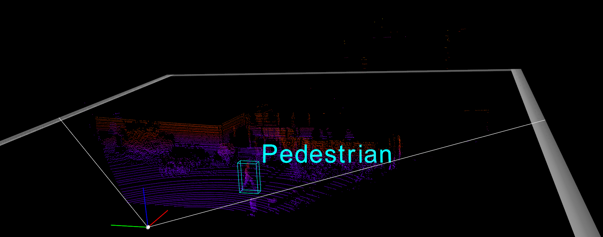

# OpenPCDet

`OpenPCDet` is a clear, simple, self-contained open source project for LiDAR-based 3D object detection. 

This tutorial is about 3D Multi Object Detection using Lidar and includes detailed information for related papers, model architectures, dataset types and the usage of OpenPCDET for this goal. To have other informations about OpenPCDET or related issues please refer to the official repo which I forked from.

# Includings

## 3D Data Types

* Point Cloud
* RGBD
* Digital Photogrammetry

## Dataset Types

* Kitti 
* Nuscene
* Pandaset

ADD at the and a table for comparing the datasets with advantages - disadvantages

## Paper Reviews

* Pointnet
* Voxelnet
* Second
* Pointpillar
* PV-RCNN


## OpenPCDET Usage and Experiments

* Build the Environment
* Train Evaluate and Inference with Kitti
* Common Errors and the Ways to Fix
* Flow Charts of The Code

## Fine Tuning with Kitti 

# 3D Data Types

3D data capture is the process of gathering information from the real world, with x, y, and z
coordinates, and making it digital. There are different types of 3D data like Point Cloud, RGBD, Digital Photogrammetry etc

## Point Cloud

AFTER

# Dataset Types

There are different datasets open for Autonomus Driving researchs. 3 of them is examined in this report.

## Kitti

The first and naturally oldest dataset. 

<b> The setup contains: </b>

- 2 RGB camera facing forward (10 Hz)
- 2 Grayscale camera facing forward (10 Hz)
- 1 Velodyne Lidar Sensor (10 Hz, 64 laser beams, 100 m range)


<b> The Lidar Coordinate System and the Ranges </b>

- x-axes : front, y-axes : left, z axes : up

- The point cloud range used for model training [0, -40, -3, 70.4, 40, 1] (xmin ymin zmin xmax ymax zmax) which gives 70.4 meters for front view, 80 meters for side view being left and right and 4 meters for the height range

- The intensity range [0,1]

- Lidar located at 1.73 m 


<b>  Format </b>

- Lidar data contains x, y, z, intensity informations and its in .bin format

  

- Object Detection annotation files contains the following information and its in .txt format 
          

   
   

* The dataset contains 8 classes for object detection: Car, Van, Truck, Pedestrian, Person(sitting), Cyclist, Tram, Misc 

- In addition to the Object Detection dataset and annotations, there is another dataset for Object Tracking having the data arranged in sequences rather than different scenes from different moments like in Object Detection dataset. For this dataset the annotation format has 2 additional info 

   
   


* As seen in annotation format too, <b> the ground truth annotations of the KITTI dataset has been provided in the 2D image space (in left grayscale camera frame called reference camera frame) not in 3D lidar space. </b> Therefore, to work with Lidar data, these 2D annotations should be converted to the 3D space using calibration files which gives the rotation and translation matrices between the lidar and camera sensors for each spesific frame.  <b>  Having annotations in image space is the base reason to cut the poing cloud x axis range to [0,70]. So we use only the front view but not the back view since the cameras only setup face forward (since the annotations located only in front side) . </b> 

   

   <b> P2 </b> : the left RGB camera's projection matrix from the reference camera frame

   <b> R0_rect </b>: Rectification matrix (correct the planar alignment between camera and reference camera frame) 

   <b>  Tr_velo_to_cam </b>: Point clouds frame to reference camera frame rigid body transformation (translation + rotation) matrix

   To understand better the usage of these calibration information, the data transformation between annotation boxes to lidar data is explained below.

<b> Data Transformation in Kitti </b>

* There are 3 steps between lidar and image plane:

   

   In general, to project bounding boxes in lidar space, we first go from lidar to image plane to eliminate the point clouds staying outside of the image borders. Then project the bounding boxes on this newly created lidar space.

   From Lidar to Image Plane
   ```

   proj_mat = P2 @ R0_rect @ Tr_velo_to_cam

   ```

   Boxes in lidar plane 

   ```

   R_inv = np.linalg.inv(R0_rect)
   Tr_inv = np.linalg.inv(Tr_velo_to_cam)

   proj_mat = R_inv @ Tr_inv 

   ```

   Bounding boxes in cropped lidar space:

   

   Bounding boxes in not cropped lidar space:

    
   


   To visualize bounding boxes in images, a simple projection should be applied too since the bounding boxes are in reference camera frame and the RGB images are provided in the dataset. (which is better than grayscale reference camera to visualize...) 

   3D Bounding Boxes In Cam2 Image Plane

   ```
   proj_mat = P2

   ```

   

   Most of the frameworks to train a model with kitti already applies these transformations as preprocess, but to visualize or process the data manually this [repo](https://github.com/darylclimb/cvml_project/tree/cb06850b9477550b9c9e3c5651d013b347cc9b1b/projections/lidar_camera_projection)  can be used. 

<b> Visualization </b>

Another nice [repo](https://github.com/kuixu/kitti_object_vis) to visualize kitti with ground truth boxes and labels in 3D lidar space. I use this one to visualize ground truths at the same time with the model output to compare.
Using  repo, the kitti point cloud data with ground truth boxes can be visualized in 3D space.

1. conda create -n kitti_vis python=3.7
2. conda activate kitti_vis
3. pip install opencv-python pillow scipy matplotlib
4. conda install mayavi -c conda-forge
5. pip install poetry
6. pip install importlib-resources
7. put your data in data/object/ folder as explained in readme <br>
   
8. python kitti_object.py --show_lidar_with_depth --img_fov --const_box --vis

   


<b> Links </b>

* Object Detection Dataset: http://www.cvlibs.net/datasets/kitti/eval_object.php?obj_benchmark=3d 

* Object Tracking Dataset : http://www.cvlibs.net/datasets/kitti/eval_tracking.php 

* Kitti Dataset Paper : http://www.cvlibs.net/publications/Geiger2012CVPR.pdf 

* Data Transform : https://github.com/darylclimb/cvml_project/tree/cb06850b9477550b9c9e3c5651d013b347cc9b1b/projections/lidar_camera_projection 

* Visualization : https://github.com/kuixu/kitti_object_vis 

## Pandaset

<b> The setup contains: </b>

* 6 RGB camera located to have 360 degree view from front to back (10 Hz)
* 2 Lidar : Pandar64 -mechanical 360° (10 Hz, 64 channel beams, 200 m rang)) and PandarGT -forward facing (10 Hz, 150 channel beams, 300 m range)

   


<b> The Lidar Coordinate System and the Ranges </b>

- x-axes : left, y-axes : back, z axes : up

- The point cloud range used for model training:


   for Pandar64 [-70, -40, -3, 70, 40, 1] (xmin ymin zmin xmax ymax zmax) <br>
   for PandarGT [0, -40, -3, 211, 40, 1] (xmin ymin zmin xmax ymax zmax) 

- The intensity range [0,255]

- Lidar located at ?? (missing info)


<b>  Format </b>

- Lidar data contains x, y, z, intensity, timestamp and lidar id information in .pkl format

   if d = 0 : Pandar64 <br>
   if d = 1 : PandarGT

   

- Annotation files in .pkl format

   

   ```
   Index(['uuid', 'label', 'yaw', 'stationary', 'camera_used', 'position.x',
       'position.y', 'position.z', 'dimensions.x', 'dimensions.y',
       'dimensions.z', 'attributes.object_motion', 'cuboids.sibling_id',
       'cuboids.sensor_id', 'attributes.rider_status',
       'attributes.pedestrian_behavior', 'attributes.pedestrian_age'],
      dtype='object')
   ```

<b> Visualization </b>

Didnt try

<b> Links </b>

* Dataset: https://scale.com/open-datasets/pandaset 

* Panda Dataset Paper : https://arxiv.org/pdf/2112.12610.pdf 

* Devkit : https://github.com/scaleapi/pandaset-devkit 

## Nuscene


<b> The setup contains: </b>

* 6 RGB camera located to have 360 degree view from front to back (12 Hz)
* 1 Lidar : 32 beams, 20Hz 

   


<b> The Lidar Coordinate System and the Ranges </b>

- x-axes : right, y-axes : front, z axes : up

- The point cloud range used for model training [-51.2, -51.2, -5.0, 51.2, 51.2, 3.0]  (xmin ymin zmin xmax ymax zmax) 
- The intensity range [0,255]

- Lidar located at 1.84 m


<b>  Format </b>

- Lidar data contains x, y, z, intensity, and timestamp information in .bin format

   

- Annotation files in .json format

   Instead of having an individual annotation file for each lidar - image pair, it is stored in one sample_annotation.json file with scene - frame information

   


<b> Visualization </b>

Using this [repo](https://github.com/pyaf/nuscenes_viz) its pretty easy to visualize nuscene data with ground truths in 3D lidar space. 

1. Clone the repo
2. conda create -n nuscene-vis python=3.7
3. pip install -U lyft_dataset_sdk
4. pip install mayavi
5. pip install psutil
5. pip install pyqt5
6. python lyft_viz.py -d /home/yagmur/Desktop/OpenPCDet/data/nuscenes/v1.0-mini/visualize/ --scene fcbccedd61424f1b85dcbf8f897f9754

   

!! If you have an error saying  Could not load the Qt platform plugin "xcb", just go to anacondaenv->lib/python3.7/site-packages/cv2/qt/plugins and delete this plugins folder

Everytime pressing enter, it is passed to the next "sample" in the "selected scene"


<b> Links </b>

* Dataset:  https://www.nuscenes.org/nuscenes 

* Nuscene Dataset Paper :  https://arxiv.org/pdf/1903.11027.pdf 

* Devkit : https://github.com/nutonomy/nuscenes-devkit

* Visualization : https://github.com/pyaf/nuscenes_viz 

## Comparison Table


# Paper Reviews

## Pointnet

paper : https://arxiv.org/pdf/1612.00593.pdf  
a good video explains the paper : https://www.youtube.com/watch?v=_py5pcMfHoc
official code :https://github.com/charlesq34/pointnet

* First paper proposes to process 3D points directly, without projecting to 2D images etc
* Challenges for processing point clouds <br>
   1. The lidar data is unstructured so the model should be permutation invariant (if you have n points you have n! permutations of ordering and processing this data)

       

   2. Interaction of points (the relation between neighbor points (local features) and general relation (global features) should be extracted. For classification, the global features are important since the task is to decide for a global class for the whole point cloud. For segmentation,  a combination of local and global knowledge is required

   3. The model should be transform(translation - rotation) invariant  (A chair is still a chair when its rotated 90 degree etc°

   ### Model Architecture


    

   * <b> Input and Feature Transform </b>

      Both using T-Net (which is an independent neural network consists of 3 convolutional, 1 max pooling and 2 fully connected layers inorde) trained to estimate different transform matrices to be applied by matrix multiplication. Input transform is applied to the first input and the feature transform to the first feature map comes after input layer.

      This is the <b> solution for transform invariant </b> challenge that this paper proposes!

   * <b> MLP (Multi layer perception) </b>

      Nothing more than a fully connected layer. The trick here is to use this fully connected layer 1 by 1 to the points come from transform layer then to concatanate.

   * <b> Max Pooling </b>

      The second MLP layer gives nx1024 output and a maximul pooling layer is applied on it. In this way, the global features are obtained without depending on the points order. <b> This is the solution for unstructured data challenge </b> that the paper proposes! 

   * These global features directly goes to classify the point cloud

   * Local and global features are concatenated for segmentation part as an extention of the    architecture.

      

   
   PointNet architecture doesnt allow to do Object Detection alone but after this paper, various methods to realize object detection on point cloud data is started to come up.

