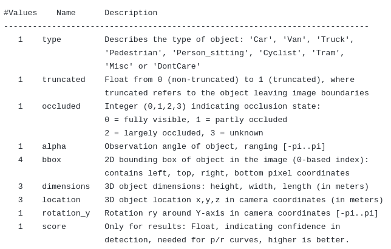

# OpenPCDet

`OpenPCDet` is a clear, simple, self-contained open source project for LiDAR-based 3D object detection. 

This tutorial is about 3D Multi Object Detection using Lidar and includes detailed information for related papers, model architectures, dataset types and the usage of OpenPCDET for this goal. To have other informations about OpenPCDET or related issues please refer to the official repo which I forked from.

# Includings

## 3D Data Types

* Point Cloud
* RGBD
* Digital Photogrammetry

## Dataset Types

* Kitti 
* Nuscene
* Pandaset

ADD at the and a table for comparing the datasets with advantages - disadvantages

## Paper Reviews

* Pointnet
* Voxelnet
* Second
* Pointpillar
* PV-RCNN


## OpenPCDET Usage and Experiments

* Build the Environment
* Train Evaluate and Inference with Kitti
* Common Errors and the Ways to Fix
* Flow Charts of The Code

## Fine Tuning with Kitti 

# 3D Data Types

3D data capture is the process of gathering information from the real world, with x, y, and z
coordinates, and making it digital. There are different types of 3D data like Point Cloud, RGBD, Digital Photogrammetry etc

## Point Cloud

AFTER

# Dataset Types

There are different datasets open for Autonomus Driving researchs. 3 of them is examined in this report.

## Kitti

The first and naturally oldest dataset. 

<b> The setup contains: </b>

- 2 RGB camera facing forward (10 Hz)
- 2 Grayscale camera facing forward (10 Hz)
- 1 Velodyne Lidar Sensor (10 Hz, 64 laser beams, 100 m range)


<b> The Lidar Coordinate System and the Ranges </b>

- x-axes : front, y-axes : left, z axes : up

- The point cloud range used for model training [0, -40, -3, 70.4, 40, 1] (xmin ymin zmin xmax ymax zmax) which gives 70.4 meters for front view, 80 meters for side view being left and right and 4 meters for the height range

- The intensity range [0,1]

- Lidar located at 1.73 m 


<b>  Format </b>

- Lidar data contains x, y, z, intensity informations and its in .bin format

   

- Object Detection annotation files contains the following information and its in .txt format

   
   

- In addition to the Object Detection dataset and annotations, there is another dataset for Object Tracking having the data arranged in sequences rather than different scenes from different moments like in Object Detection dataset. For this dataset the annotation format has 2 additional info 

   
   

* As seen in annotation format too, <b> the ground truth annotations of the KITTI dataset has been provided in the 2D image space (in left grayscale camera frame called reference camera frame) not in 3D lidar space. </b> Therefore, to work with Lidar data, these 2D annotations should be converted to the 3D space using calibration files which gives the rotation and translation matrices between the lidar and camera sensors for each spesific frame.  <b>  Having annotations in image space is the base reason to cut the poing cloud x axis range to [0,70]. So we use only the front view but not the back view since the cameras only setup face forward (since the annotations located only in front side) . </b> 

   

   <b> P2 </b> : the left RGB camera's projection matrix from the reference camera frame

   <b> R0_rect </b>: Rectification matrix (correct the planar alignment between camera and reference camera frame) 

   <b>  Tr_velo_to_cam </b>: Point clouds frame to reference camera frame rigid body transformation (translation + rotation) matrix

   To understand better the usage of these calibration information, the data transformation between annotation boxes to lidar data is explained below.

<b> Data Transformation in Kitti </b>


In general, to project bounding boxes in lidar space, we first go from lidar to image plane to eliminate the point clouds staying outside of the image borders. Then project the bounding boxes on this newly created lidar space.

From Lidar to Image Plane
```

proj_mat = P2 @ R0_rect @ Tr_velo_to_cam

```

Boxes in lidar plane 

```

R_inv = np.linalg.inv(R0_rect)
Tr_inv = np.linalg.inv(Tr_velo_to_cam)

proj_mat = R_inv @ Tr_inv 

```

Bounding boxes in cropped lidar space:


Bounding boxes in not cropped lidar space:

 


To visualize bounding boxes in images, a simple projection should be applied too since the bounding boxes are in reference camera frame and the RGB images are provided in the dataset. (which is better than grayscale reference camera to visualize...) 

3D Bounding Boxes In Cam2 Image Plane

```
proj_mat = P2

```


Most of the frameworks to train a model with kitti already applies these transformations as preprocess, but to visualize or process the data manually this [repo](https://github.com/darylclimb/cvml_project/tree/cb06850b9477550b9c9e3c5651d013b347cc9b1b/projections/lidar_camera_projection)  can be used. 

<b> Visualization </b>

Another nice [repo](https://github.com/kuixu/kitti_object_vis) to visualize kitti with ground truth boxes and labels in 3D lidar space. I use this one to visualize ground truths at the same time with the model output to compare.
Using  repo, the kitti point cloud data with ground truth boxes can be visualized in 3D space.

1. conda create -n kitti_vis python=3.7
2. conda activate kitti_vis
3. pip install opencv-python pillow scipy matplotlib
4. conda install mayavi -c conda-forge
5. pip install poetry
6. pip install importlib-resources
7. put your data in data/object/ folder as explained in readme
   
8. python kitti_object.py --show_lidar_with_depth --img_fov --const_box --vis


<b> Links </b>

* Object Detection Dataset: http://www.cvlibs.net/datasets/kitti/eval_object.php?obj_benchmark=3d 

* Object Tracking Dataset : http://www.cvlibs.net/datasets/kitti/eval_tracking.php 

* Kitti Dataset Paper : http://www.cvlibs.net/publications/Geiger2012CVPR.pdf 

* Data Transform : https://github.com/darylclimb/cvml_project/tree/cb06850b9477550b9c9e3c5651d013b347cc9b1b/projections/lidar_camera_projection 

* Visualization : https://github.com/kuixu/kitti_object_vis 

## Pandaset

<b> The setup contains: </b>


<b> The Lidar Coordinate System and the Ranges </b>


<b>  Format </b>


## Nuscene


# Paper Reviews

